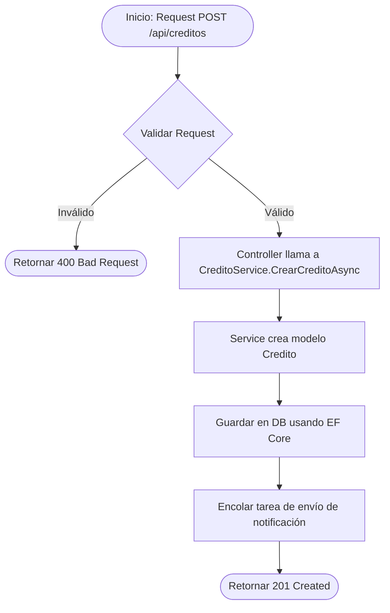
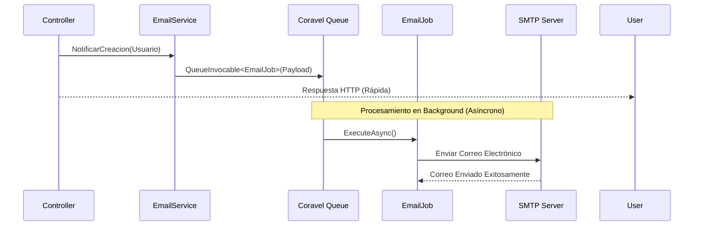
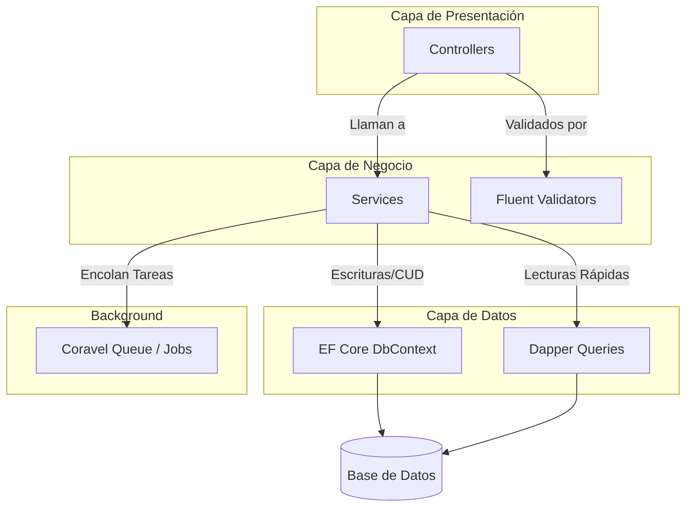

# Guía y Documentación Técnica - RegistroCreditos.WebApi

Esta guía sirve como referencia definitiva y técnica para el desarrollo y mantenimiento del proyecto `RegistroCreditos.WebApi`.

## 1. Estructura del Proyecto

El proyecto está organizado en carpetas clave para separar responsabilidades de forma clara:

- **`Data`**: Contiene el contexto de Entity Framework (`DbContext`), configuraciones de entidades y repositorios si aplica, además de las migraciones.
- **`DTOs`**: Data Transfer Objects. Objetos utilizados para transportar datos entre las capas, principalmente entre Controllers y Services, definiendo payloads de entrada y salida.
- **`Models`**: Entidades del dominio, que representan la estructura de las tablas en la base de datos (Ej. `Credito`, `Usuario`).
- **`Services`**: Capa de lógica de negocio. Contiene las reglas del sistema y orquesta las operaciones de lectura, escritura y encolado de tareas.
- **`Validators`**: Clases de validación utilizando FluentValidation para asegurar la integridad de los datos de entrada antes de procesarlos.
- **`Tests`**: Proyectos o carpetas dedicadas a pruebas unitarias y de integración para asegurar la calidad del código.

## 2. Stack y Paquetes Usados

Este proyecto está construido con herramientas y librerías modernas para maximizar rendimiento y mantenibilidad:

- **.NET 10**: Framework base.
- **Entity Framework Core (EF Core)**: ORM principal usado para migraciones y operaciones de escritura (CUD).
- **Dapper**: Micro ORM utilizado exclusivamente para operaciones de lectura complejas o de alto rendimiento (Queries).
- **Coravel**: Herramienta ligera utilizada para el procesamiento en segundo plano (Background Jobs) y encolado de tareas (ej. envío de correos).
- **FluentValidation**: Validación fluida y fuertemente tipada de modelos y DTOs.
- **BCrypt**: Librería segura para el hashing y verificación de contraseñas.

## 3. Arquitectura

El sistema sigue principios de diseño limpio y una arquitectura simplificada orientada a CQRS (CQRS-lite):

- **CQRS-lite (Command and Query Responsibility Segregation)**: Se separan explícitamente las operaciones de lectura y escritura. Las escrituras (Commands) usan EF Core, mientras que las lecturas complejas o masivas (Queries) usan Dapper.
- **SRP (Single Responsibility Principle)**: Cada clase tiene una única responsabilidad. Los servicios son altamente especializados.
- **Delegación de Controladores**: Los controladores actúan como puntos de entrada (Endpoints). No contienen lógica de negocio. Su única labor es recibir el request HTTP, validarlo (automáticamente o vía inyección), delegar la operación al servicio correspondiente y retornar un ActionResult.

## 4. Diagramas de Arquitectura y Flujos

### Proceso de Creación de Crédito (Diagrama de Flujo)



### Envío Asíncrono de Correos (Diagrama de Secuencia)



### Componentes y Relaciones (Diagrama de Paquetes)



## 5. Reglas de Desarrollo

Para mantener la coherencia y calidad del código, se deben seguir estrictamente estas reglas:

### ✅ SÍ Permitido (Buenas Prácticas)
- Inyectar dependencias utilizando exclusivamente el constructor.
- Crear validadores con FluentValidation e inyectarlos (o usarlos vía middleware/filters).
- Utilizar **Dapper solo para consultas pesadas o de pura lectura** (Queries y reportes).
- Usar registros (`record`) para los DTOs si se desea inmutabilidad.
- Encolar tareas que no deban bloquear la respuesta HTTP (ej. correos, generación de PDFs) usando Coravel.

### ❌ NO Permitido (Anti-Patrones)
- **NO** inyectar `DbContext` directamente en los Controladores. Siempre debe pasar por un Servicio.
- **NO** usar Dapper para realizar escrituras, actualizaciones o borrados (usar EF Core para eso).
- **NO** colocar lógica de negocio o reglas de dominio complejas en los Controladores.
- **NO** usar la entidad de dominio (`Credito`, `Usuario`) directamente como respuesta (Output DTO) del API; siempre mapear a un DTO de respuesta.

## 6. Migraciones (EF Core)

Los cambios en la base de datos se gestionan exclusivamente mediante Entity Framework Core CLI.

- **Añadir una nueva migración**:
  Cuando modifiques los modelos, genera una migración describiendo el cambio:
  ```bash
  dotnet ef migrations add NombreDeLaMigracion
  ```

- **Aplicar migraciones a la Base de Datos**:
  ```bash
  dotnet ef database update
  ```
